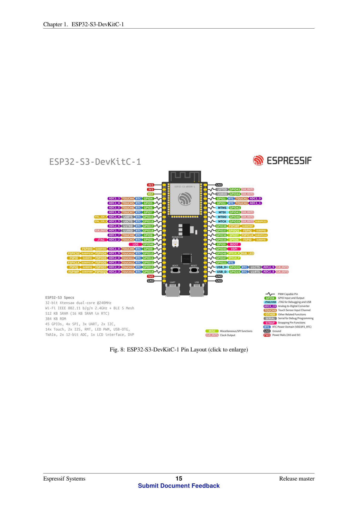

# ESP32-S3 · Rapid Bike 하드웨어 매뉴얼

이 문서는 `ESP32-S3-DevKitC-1` 계열 보드와 Rapid Bike ECU를 연결할 때 필요한 배선, 전원, LED 상태, 설치 및 복구 절차를 정리합니다.

## 준비물

- ESP32-S3-DevKitC-1 호환 보드
- 데이터 통신이 가능한 USB 케이블
- 3.3V TTL UART 배선
- Rapid Bike ECU 또는 검증된 테스트 장치
- Windows PC와 Python 3.10 이상

## 배선

### Rapid Bike UART

| ESP32-S3 핀 | 방향(ESP32 기준) | Rapid Bike 측 | 펌웨어 설정 |
|---|---:|---|---|
| GPIO17 | 출력 | RX | `RAPIDBIKE_TX_PIN = 17` |
| GPIO18 | 입력 | TX/Data | `RAPIDBIKE_RX_PIN = 18` |
| GND | 공통 | GND | 공통 신호 기준 |

TX와 RX는 교차 연결합니다. 커넥터 색상만 믿지 말고 멀티미터 또는 회로도로 GND와 신호선을 다시 확인하세요.

### PC USB-to-UART

PC는 DevKit의 USB-to-UART 포트에 연결합니다. 보드 내부 USB-UART 브리지는 GPIO43(`U0TXD`)과 GPIO44(`U0RXD`)를 사용하므로 이 두 핀에 별도 점퍼를 연결하지 않습니다. Windows에서 나타난 COM 포트가 설치 스크립트의 `-Port` 값입니다.

## 전원 및 보호 주의사항

1. ESP32 GPIO 허용 전압은 3.3V 기준입니다. 5V 및 차량 12V를 GPIO17/18에 직접 연결하지 마세요.
2. ESP32는 USB 또는 검증된 5V/3.3V 레귤레이터로 전원 공급합니다.
3. Rapid Bike와 ESP32 사이에는 공통 GND가 필요합니다.
4. 차량 전장에 영구 설치할 때는 역전압, 로드덤프, 접지 전위차, 진동과 수분에 대한 별도 보호 회로가 필요합니다.
5. 배선을 바꾸기 전에는 차량과 보드 전원을 모두 끄세요.

## 보드 핀 및 리비전 주의사항

- UART1 기본 핀: GPIO17 TX, GPIO18 RX
- USB-UART 기본 핀: GPIO43 TX, GPIO44 RX
- ESP32-S3-DevKitC-1 초기형 RGB LED: GPIO48
- ESP32-S3-DevKitC-1 v1.1 RGB LED: GPIO38
- Octal Flash/PSRAM 모듈은 GPIO35~37을 내부 통신에 사용할 수 있으므로 외부 장치에 연결하지 않습니다.

운영 펌웨어는 보드 리비전 차이를 처리하기 위해 GPIO38과 GPIO48의 RGB LED를 모두 시도합니다.



## LED 상태

| 색상 | 의미 |
|---|---|
| 녹색 | 브리지 준비 완료/대기 |
| 파란색 | PC 또는 Wi-Fi에서 ECU로 명령 송신 |
| 청록색 | ECU 응답 수신 |
| 주황색 | 9600↔38400 baud 전환 |
| 빨간색 | 치명적 오류, `bridge_error.txt` 기록 |

## 통신 흐름

```text
Windows 피트월/RB Master
       │ USB-to-UART (GPIO43/44)
       ▼
    ESP32-S3
       │ UART1 3.3V TTL (GPIO17/18)
       ▼
   Rapid Bike ECU

Windows 피트월 ── Wi-Fi TCP 8888 ──► ESP32-S3 ──► Rapid Bike ECU
```

펌웨어는 9600 baud, 8 data bits, parity 없음, stop bit 1개로 시작합니다. Rapid Bike의 속도 전환 프레임과 응답을 감지하면 PC와 ECU UART를 함께 38400 baud로 전환합니다.

## 펌웨어 설치와 복구

운영 파일 설치:

```powershell
cd .\firmware\esp32-s3-rapidbike\micropython\tools
.\install_wired_bridge.ps1 -Port COM8
```

`main.py`가 실행된 뒤에는 UART 콘솔이 브리지 전용으로 전환되어 일반 REPL 접속이 되지 않는 것이 정상입니다.

복구 모드 진입:

1. `BOOT` 버튼을 누른 상태로 유지합니다.
2. `RST/EN` 버튼을 짧게 누릅니다.
3. `BOOT` 버튼을 놓습니다.
4. Windows 장치 관리자에서 새 COM 포트를 확인합니다.
5. 필요하면 MicroPython 기본 이미지를 다시 플래시한 뒤 `main.py`를 설치합니다.

## Wi-Fi 모드

`wifi_config.py`가 있으면 등록된 공유기/핫스팟에 STA 모드로 접속합니다. 7초 이내 연결되지 않거나 설정 파일이 없으면 다음 AP를 생성합니다.

```text
SSID: RapidBike-ESP32
IP: 192.168.4.1
TCP: 8888
UDP discovery: 8889
```

실제 Wi-Fi 비밀번호가 들어 있는 파일은 커밋하지 마세요. 예제 파일만 복사해 사용합니다.

## 공식 문서

- [저장소에 포함된 ESP32-S3 전체 PDF](esp32-s3-devkitc-1-user-guide.pdf)
- [Espressif 최신 온라인 문서](https://docs.espressif.com/projects/esp-dev-kits/en/latest/esp32s3/esp32-s3-devkitc-1/index.html)
- [Espressif esp-dev-kits 원본 저장소](https://github.com/espressif/esp-dev-kits)

동봉 PDF 및 문서에서 파생한 이미지는 Espressif 출처이며 CC BY-SA 4.0 조건을 따릅니다. PDF 내용은 변경하지 않았고 파일명만 정리했습니다.
